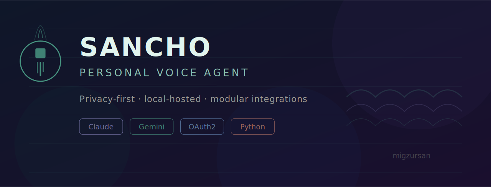
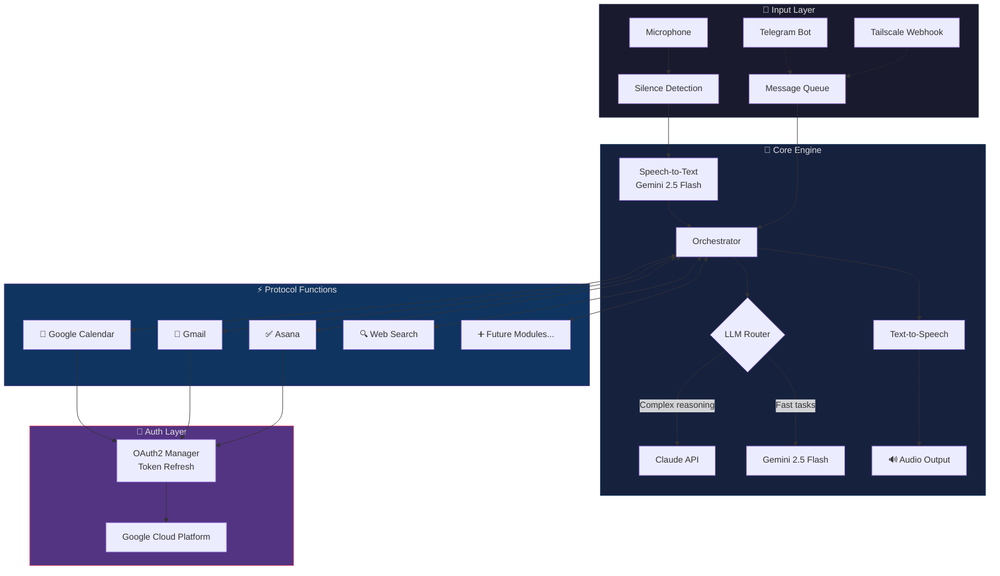
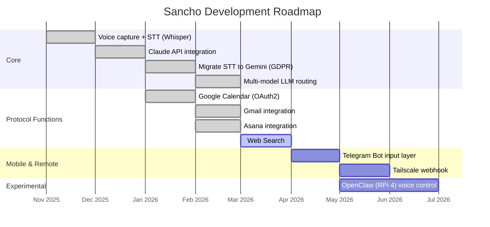

<p align="center">
  
</p>

<h1 align="center">Sancho — Personal Voice Agent</h1>

<p align="center">
  <strong>A locally-hosted, voice-activated AI assistant with modular integrations and privacy-first design.</strong>
</p>

<p align="center">
  
  
  
  
  
  
</p>

<p align="center">
  <a href="#architecture">Architecture</a> •
  <a href="#how-it-works">How It Works</a> •
  <a href="#protocol-functions">Protocol Functions</a> •
  <a href="#setup">Setup</a> •
  <a href="#roadmap">Roadmap</a> •
  <a href="#lessons-learned">Lessons Learned</a>
</p>

---

## Why Sancho?

Most AI assistants live in the cloud, behind a subscription, with your data leaving your machine on every interaction. Sancho is different:

- **Runs locally** on a MacBook Pro — no server, no middleman
- **Voice-first** with silence-detection recording — talk naturally, no wake word needed
- **GDPR-compliant** by design — migrated from OpenAI Whisper to Gemini 2.5 Flash to keep data processing within EU-compliant infrastructure
- **Modular protocol functions** — each integration (Calendar, Gmail, Asana) is a self-contained module that can be added, removed, or swapped independently
- **Multi-model capable** — built to switch between Claude, Gemini, or local models depending on task requirements

The name? Every great adventurer needs a loyal squire. Sancho is the pragmatic companion that handles the logistics so you can focus on the quest.

---

## Architecture



### Design Decisions

| Decision | Choice | Why |
|---|---|---|
| **STT Engine** | Gemini 2.5 Flash (migrated from Whisper) | GDPR compliance — needed EU data processing guarantees |
| **LLM Strategy** | Multi-model with routing | Claude excels at reasoning; Gemini is faster for simple tasks and STT |
| **Architecture** | Modular protocol functions | Each integration is independently deployable and testable |
| **Input** | Silence-detection (not wake-word) | More natural conversation flow; lower latency to first response |
| **Hosting** | Local-first (MacBook Pro) | Privacy, zero cloud cost, full control over data |

---

## How It Works

### 1. Voice Capture with Silence Detection

```
┌─────────────────────────────────────────────────────────┐
│  Ambient ──▶ Speech Detected ──▶ Recording ──▶ Silence  │
│     🔇            🎤               🔴          ⏱️ 1.5s  │
│                                                   │     │
│                                          Trigger STT    │
└─────────────────────────────────────────────────────────┘
```

Instead of a wake word ("Hey Sancho"), the agent monitors audio levels and automatically detects when you start and stop speaking. A configurable silence threshold (default: 1.5s) determines when to process the captured audio.

### 2. Protocol Function Pattern

Every integration follows the same contract. This makes adding new capabilities trivial:

```python
# protocol_functions/base.py
class ProtocolFunction(ABC):
    """Base class for all Sancho integrations."""
    
    @property
    @abstractmethod
    def name(self) -> str:
        """Human-readable name for LLM tool selection."""
        ...

    @property
    @abstractmethod
    def description(self) -> str:
        """Description the LLM uses to decide when to invoke this function."""
        ...

    @abstractmethod
    async def execute(self, params: dict) -> ProtocolResult:
        """Execute the function with validated parameters."""
        ...

    @abstractmethod
    def schema(self) -> dict:
        """JSON Schema for parameter validation."""
        ...
```

```python
# protocol_functions/calendar.py
class CalendarFunction(ProtocolFunction):
    name = "google_calendar"
    description = "Create, read, update, or query Google Calendar events"

    async def execute(self, params: dict) -> ProtocolResult:
        action = params["action"]  # "list", "create", "update", "delete"
        
        match action:
            case "list":
                return await self._list_events(params)
            case "create":
                return await self._create_event(params)
            # ...
```

### 3. Conversation Flow

```
You: "What do I have tomorrow morning?"
                    │
          ┌─────────▼──────────┐
          │  STT (Gemini 2.5)  │
          └─────────┬──────────┘
                    │ text
          ┌─────────▼──────────┐
          │   Orchestrator     │
          │   Selects: Claude  │
          │   Tool: Calendar   │
          └─────────┬──────────┘
                    │
          ┌─────────▼──────────┐
          │  Protocol Function │
          │  calendar.list()   │
          │  → OAuth2 → GCal   │
          └─────────┬──────────┘
                    │ events[]
          ┌─────────▼──────────┐
          │  LLM formats reply │
          └─────────┬──────────┘
                    │
          ┌─────────▼──────────┐
          │  TTS → Speaker     │
          └────────────────────┘

Sancho: "Tomorrow morning you have a standup at 9 and
         a dentist appointment at 11:30."
```

---

## Protocol Functions

| Module | Status | Description |
|---|---|---|
| 📅 **Google Calendar** | ✅ Live | Full CRUD on events, natural language time parsing |
| 📧 **Gmail** | ✅ Live | Read, search, draft, and send emails |
| ✅ **Asana** | ✅ Live | Task creation, project queries, status updates |
| 🔍 **Web Search** | 🔧 In Progress | Real-time web lookup for contextual answers |
| 💬 **Telegram Bot** | 📋 Planned | Mobile input layer — text Sancho from anywhere |
| 🌐 **Tailscale Webhook** | 📋 Planned | Secure remote access without exposing ports |
| 🤖 **OpenClaw (RPi 4)** | 🧪 Experimental | Physical robotics control via voice commands |

### Adding a New Protocol Function

```bash
# 1. Create your module
cp protocol_functions/_template.py protocol_functions/my_integration.py

# 2. Implement the ProtocolFunction interface
# 3. Register it in config/functions.yaml

functions:
  - name: my_integration
    enabled: true
    auth: oauth2  # or "api_key" or "none"

# 4. Restart Sancho — it auto-discovers new functions
```

---

## Tech Stack

| Layer | Technology |
|---|---|
| **Language** | Python 3.11+ |
| **LLM (Reasoning)** | Claude API (Anthropic) |
| **LLM (Fast + STT)** | Gemini 2.5 Flash (Google) |
| **Speech-to-Text** | Gemini 2.5 Flash (previously Whisper) |
| **Text-to-Speech** | System TTS / Google Cloud TTS |
| **Auth** | OAuth2 with automatic token refresh |
| **Cloud Project** | Google Cloud Platform |
| **Task Queue** | asyncio |
| **Config** | YAML + environment variables |

---

## Setup

### Prerequisites

- Python 3.11+
- Google Cloud project with Calendar, Gmail, and Tasks APIs enabled
- Anthropic API key
- Google Gemini API key
- A microphone

### Installation

```bash
# Clone the repo
git clone https://github.com/migzursan/sancho-voice-agent.git
cd sancho-voice-agent

# Create virtual environment
python -m venv venv
source venv/bin/activate

# Install dependencies
pip install -r requirements.txt

# Configure credentials
cp .env.example .env
# Edit .env with your API keys

# Set up OAuth2 (one-time browser auth flow)
python scripts/setup_oauth.py

# Run Sancho
python main.py
```

### Configuration

```yaml
# config/sancho.yaml
llm:
  default: gemini        # Fast model for simple queries
  reasoning: claude       # Complex reasoning and planning
  stt: gemini            # Speech-to-text engine

voice:
  silence_threshold: 1.5  # Seconds of silence before processing
  sample_rate: 16000
  channels: 1

protocol_functions:
  google_calendar:
    enabled: true
  gmail:
    enabled: true
  asana:
    enabled: true
```

---

## Project Structure

```
sancho-voice-agent/
├── main.py                      # Entry point
├── config/
│   ├── sancho.yaml              # Main configuration
│   └── functions.yaml           # Protocol function registry
├── core/
│   ├── orchestrator.py          # Central brain — routes intents to functions
│   ├── llm_router.py            # Multi-model LLM selection logic
│   ├── voice_capture.py         # Microphone + silence detection
│   └── auth/
│       └── oauth2_manager.py    # Token management + auto-refresh
├── protocol_functions/
│   ├── base.py                  # Abstract base class
│   ├── _template.py             # Template for new functions
│   ├── calendar.py              # Google Calendar integration
│   ├── gmail.py                 # Gmail integration
│   └── asana.py                 # Asana integration
├── scripts/
│   └── setup_oauth.py           # One-time OAuth2 setup
├── tests/
│   ├── test_orchestrator.py
│   └── test_protocol_functions/
├── docs/
│   └── assets/
│       ├── sancho-banner.png
│       ├── architecture.png
│       └── demo.gif
├── .env.example
├── requirements.txt
└── README.md
```

---

## Roadmap



---

## Lessons Learned

Building Sancho as a solo side project taught me things that managing AI products at scale reinforced:

### 1. GDPR changes your architecture, not just your policy
Moving from Whisper (OpenAI) to Gemini wasn't a config swap. It changed latency profiles, accuracy characteristics, and the entire auth flow. Privacy compliance is an architectural decision, not a checkbox.

### 2. Modular beats monolithic from day one
The protocol function pattern paid for itself immediately. When Asana's API changed scopes, I fixed one file. When I wanted to experiment with OpenClaw robotics, I added a module without touching the core. The 30 minutes spent on the abstract base class saved 10+ hours.

### 3. Silence detection > wake words for personal agents
Wake words feel like talking to a product. Silence detection feels like talking to a person. For a personal agent that sits on your desk, the UX difference is enormous. The tradeoff is higher false-positive rates, but a simple confirmation prompt solves that.

### 4. Multi-model routing is the future
Not every query needs Claude's reasoning power. Routing simple lookups to Gemini cuts cost by ~80% and latency by ~60% on those calls. The hard part isn't the routing logic, it's defining the classification boundary between "simple" and "complex."

### What I'd Do Differently

- **Start with OAuth2 token management** before building anything else. I underestimated how much time auth plumbing would consume.
- **Build a proper logging/observability layer** earlier. Debugging voice-to-action pipelines without structured logs is painful.
- **Use WebSocket for the Telegram integration** instead of polling. Planned from the start but deprioritized, now it's harder to retrofit.

---

## Background

I built Sancho while transitioning from 8+ years leading product and AI strategy at [Vivino](https://www.vivino.com), where I shipped production AI systems including a conversational chatbot (75% ticket deflection) and a fraud detection engine (96% precision). Sancho is the intersection of what I know about building AI products and what I want from a personal assistant.

**Related projects:**
- [OmniMind Case Study](https://github.com/migzursan/omnimind-case-study) — Architecture deep-dive of the Vivino conversational AI
- [Checkout Optimization Case Study](https://github.com/migzursan/checkout-optimization-case-study) — Fraud detection + payment expansion
- [RPi Car Assistant](https://github.com/migzursan/rpi-car-assistant) — Edge AI for European road trips

---

## License

MIT License. See [LICENSE](LICENSE) for details.

---

<p align="center">
  <i>"La aventura no es más que mala planificación."</i><br/>
  <sub>— Roald Amundsen (more or less)</sub>
</p>

<p align="center">
  Built by <a href="https://migzursan.github.io">Miguel Zurbano</a>
</p>
